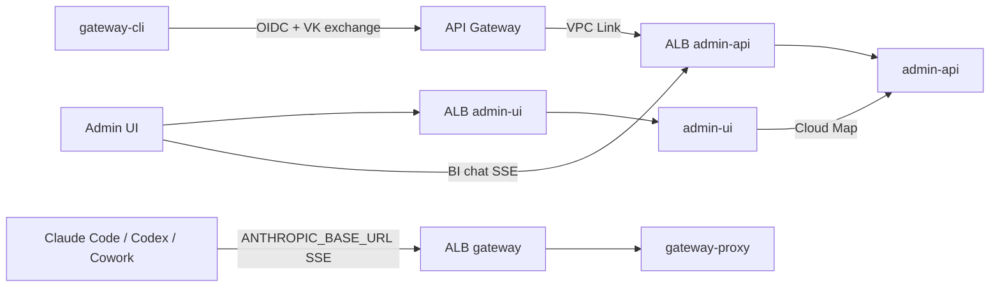
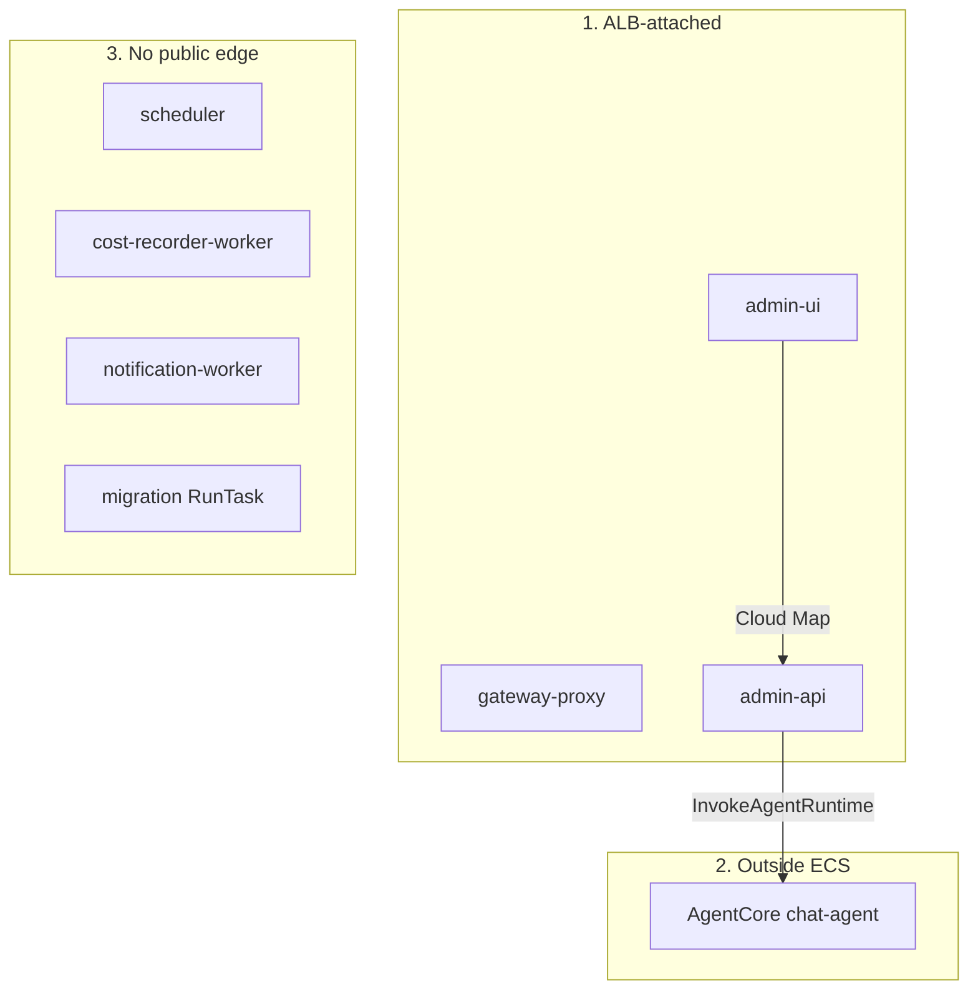
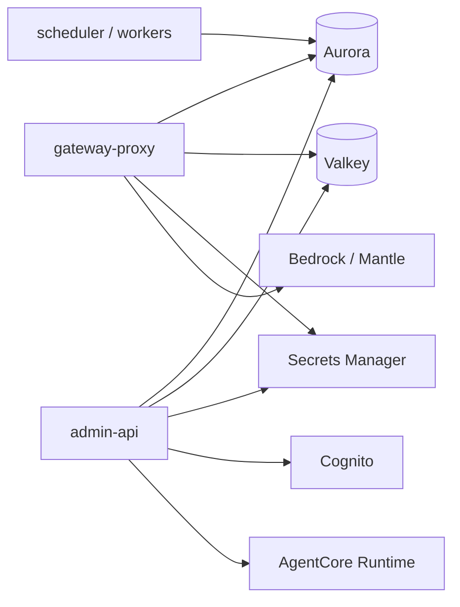

# AWSome AI Gateway (ECS fork)

> ⚠️ **샘플/프로토타입.** 프로덕션 사용 전 보안·하드닝 검토 필요.

EKS 기반 [**aws-samples / awsome-ai-gateway**](https://github.com/aws-samples/sample-agentic-ai-acceleration-kr/tree/main/projects/awsome-ai-gateway) 를  
**ECS Fargate + boto3 installer** 로 전환한 변형본입니다.

| | |
|--|--|
| **제품·기능·데모·데이터플레인·기여자** | upstream [README](https://github.com/aws-samples/sample-agentic-ai-acceleration-kr/blob/main/projects/awsome-ai-gateway/README.md) · [ARCHITECTURE](https://github.com/aws-samples/sample-agentic-ai-acceleration-kr/blob/main/projects/awsome-ai-gateway/ARCHITECTURE.md) |
| **이 레포에서 볼 것** | ECS 배포·트래픽 경계·installer Quick Guide·클라이언트 연동 |

**배포 마스터 = 이 문서.**  
상세 함정: [`deployment/ecs/installer.md`](deployment/ecs/installer.md) · 클라이언트 연동은 아래 §클라이언트 연동

---

## 목차

1. [Upstream 대비 변경](#upstream-대비-변경)
2. [ECS 아키텍처](#ecs-아키텍처-이-레포) — [트래픽](#1-트래픽-경계-클라이언트--엣지--ecs) · [워크로드](#2-ecs-워크로드) · [데이터·AI](#3-데이터-플레인--ai-백엔드)
3. [설치 Quick Guide](#설치-quick-guide) · [스택 삭제](#35-스택-삭제)
4. [일상 운영](#일상-운영)
5. [Observability](#observability)
6. [배포 시 주의사항](#배포-시-주의사항)
7. [디렉터리 맵](#디렉터리-맵)
8. [클라이언트 연동](#클라이언트-연동)
   - [엔드포인트 · Admin UI](#81-엔드포인트-매핑-ecs)
   - [gateway-cli / Claude Code / Codex / Cowork](#84-공통--gateway-cli-로그인)
   - [원복 · FAQ · 트러블슈팅](#89-원복--faq)
   - [모델 선택](#812-모델-선택)
9. [관련 문서](#관련-문서)

---

## Upstream 대비 변경

원본: [projects/awsome-ai-gateway](https://github.com/aws-samples/sample-agentic-ai-acceleration-kr/tree/main/projects/awsome-ai-gateway)

| 구분 | Upstream | 이 레포 |
|------|----------|---------|
| 컴퓨트 | EKS Fargate | **ECS Fargate** |
| IaC | Terraform + Helm | **`deployment/ecs/installer.py` (boto3)** |
| 엣지 | Ingress / ALB Controller | **ALB × 3** + **API Gateway** (admin-api REST → VPC Link) |
| 앱 IAM | IRSA | **ECS Task Role** |
| 관측 | Helm observability | **CloudWatch Logs** `/ecs/<cluster>` |
| 클라이언트 URL | 커스텀 도메인 예시 | installer `status` / `.state-*.json` 의 ALB·API GW |

추가 수정:

- SSE(gateway·BI chat)는 **ALB만** (API GW idle ~29s)
- Secrets: 앱은 `DATABASE_URL` / `DB_URL` / `REDIS_URL` — installer가 JSON 맞춤
- Cognito Hosted UI **도메인** 필수 (installer 보장)
- `gateway-cli` ≥ **0.1.1** — macOS Cognito DNS `getaddrinfo` 실패 시 dig 폴백

제품 개요·기능 목록은 upstream README의 [주요 기능](https://github.com/aws-samples/sample-agentic-ai-acceleration-kr/blob/main/projects/awsome-ai-gateway/README.md#%EC%A3%BC%EC%9A%94-%EA%B8%B0%EB%8A%A5) 참고.

---

## ECS 아키텍처 (이 레포)

**이 레포에만 다른 것 = 엣지·컴퓨트(ECS/ALB/API GW).**  
데이터 플레인·3-client 라우팅·스키마·웹서치·BI 상세는 upstream과 동일 → 중복 문서는 두지 않습니다.

| 보고 싶은 내용 | 문서 |
|----------------|------|
| 제품 아키텍처 개요 | [upstream README §아키텍처](https://github.com/aws-samples/sample-agentic-ai-acceleration-kr/blob/main/projects/awsome-ai-gateway/README.md#%EC%95%84%ED%82%A4%ED%85%8D%EC%B2%98) |
| as-built 상세 (스키마·플로우·resilience) | [upstream ARCHITECTURE.md](https://github.com/aws-samples/sample-agentic-ai-acceleration-kr/blob/main/projects/awsome-ai-gateway/ARCHITECTURE.md) |
| ECS 트래픽 ADR | [`deployment/docs/ecs-apigateway/`](deployment/docs/ecs-apigateway/) |

### Operation Architecture

한 장에 다 넣으면 렌더가 깨지므로 **트래픽 / 컴퓨트 / 데이터·AI** 세 장으로 나눕니다.

#### 1) 트래픽 경계 (클라이언트 → 엣지 → ECS)



| 경로 | 진입점 | 이유 |
|------|--------|------|
| 추론 / SSE | **gateway ALB** | API GW idle ~29s → SSE 불가 |
| admin-api REST (VK 등) | **API GW → VPC Link → ALB** | REST만 |
| BI chat SSE | **admin-api ALB** | SSE (API GW 금지) |
| Admin UI | **admin-ui ALB** | Next.js |

#### 2) ECS 워크로드

위→아래: **ALB 서비스 → AgentCore → 내부 워커**. 같은 줄은 `direction LR`로 나란히 둡니다.



| 서비스 | 역할 |
|--------|------|
| `gateway-proxy` | Messages API · Bedrock · VK 검증 |
| `admin-api` | REST · Cognito · BI SSE · 예산/팀 |
| `admin-ui` | 허용 모델 · routing · 예산 대시보드 |
| `scheduler` | ROI · VK 만료 (admin-api 이미지) |
| `cost-recorder-worker` / `notification-worker` | 비용 · 알림 |
| `migration` | Alembic (`installer.py migrate`) |
| `admin-chat-agent` | AgentCore Runtime (`chat-agent`) |

#### 3) 데이터 플레인 · AI 백엔드



배포 계층: `소스 → docker build linux/amd64 → ECR → installer.py → ECS/ALB/API GW` (+ VPC/Aurora/Valkey/Cognito).

---

## 설치 Quick Guide

이미지를 ECR에 넣기 전에 서비스만 올리면 `CannotPullContainerError` 입니다.

### 전제

| 도구 | 최소 |
|------|------|
| AWS CLI | v2 · **배포 리전** (`ap-northeast-2` 등) |
| Python | 3.10+ |
| Docker | `--platform linux/amd64` |

```bash
export AWS_REGION=ap-northeast-2
export AWS_PROFILE=<your-profile>   # 필요 시
```

### 1. config

```bash
cd deployment/ecs
pip3 install -r requirements.txt
cp config.example.yaml config.yaml
# project / environment / aws.region / imageTags / adminBootstrap 확인
```

### 2. (권장) provision

```bash
python3 installer.py provision -c config.yaml
```

### 3. ECR push

```bash
REGION=ap-northeast-2
ECR=$(aws sts get-caller-identity --query Account --output text).dkr.ecr.${REGION}.amazonaws.com
ROOT="$(git rev-parse --show-toplevel)"
aws ecr get-login-password --region "$REGION" | docker login --username AWS --password-stdin "$ECR"

build_push() {
  docker build --platform linux/amd64 -t "$ECR/llm-gateway/$2:$3" "$ROOT/$1"
  docker push "$ECR/llm-gateway/$2:$3"
}
# 태그는 config.yaml imageTags 와 동일하게
build_push gateway-proxy        gateway-proxy        1.0.48-websearch
build_push admin-api            admin-api            1.0.48-websearch
build_push admin-ui             admin-ui             1.0.97-brand
build_push cost-recorder-worker cost-recorder-worker 1.0.47-websearch
build_push notification-worker  notification-worker  latest
build_push db                   migration            1.0.49-xacct
```

### 4. deploy · 검증

```bash
python3 installer.py deploy -c config.yaml
# 또는 ./deployment/scripts/deploy-tui.sh

python3 installer.py status -c config.yaml
curl -sf "http://<gateway_alb_dns>/health"
curl -sf "<api_gateway_endpoint>/health"
```

```bash
export ANTHROPIC_BASE_URL=http://<gateway_alb_dns>
export ADMIN_API_URL=<api_gateway_endpoint>
```

### 명령

| 명령 | 동작 |
|------|------|
| `provision` / `discover` | 데이터 플레인 |
| `deploy` / `status` / `migrate` | 배포 / 상태 / DB |
| `chat-agent` | BI Insight AgentCore |
| `destroy --yes` | ECS 엣지만 |
| `uninstaller.py --yes` / `destroy --yes --all` | 전체 스택 삭제 |

옵션: `--dry-run`, `--skip-migration`. 상세: [`installer.md`](deployment/ecs/installer.md)

### 3.5 스택 삭제

```bash
cd deployment/ecs
python3 uninstaller.py -c config.yaml --dry-run          # 미리보기
python3 uninstaller.py -c config.yaml --yes              # 전체 삭제
python3 uninstaller.py -c config.yaml --yes --keep-ecr   # ECR 유지
# 또는: python3 installer.py destroy -c config.yaml --yes --all
```

| 명령 | 범위 |
|------|------|
| `uninstaller.py --yes` | chat-agent → ECS/ALB/API GW → Cloud Map/logs/SG/IAM/secrets → Cognito/Redis/Aurora/VPC → ECR → `.state-*.json` |
| `uninstaller.py --yes --keep-ecr` | 위와 동일, ECR만 유지 |
| `installer.py destroy --yes` | ECS 엣지만 (데이터 플레인 유지) |

삭제 후 클라이언트는 `gateway-cli disable` 또는 환경변수 제거가 필요합니다.  
상세: [`installer.md`](deployment/ecs/installer.md) §삭제.

---

## 일상 운영

- 이미지: ECR 푸시 → `imageTags` → `deploy --skip-migration`
- DB: `python3 installer.py migrate -c config.yaml`
- 재시작: `aws ecs update-service --cluster <cluster> --service <svc> --force-new-deployment --region $AWS_REGION`
- 로그: CloudWatch (§ Observability)

---

## Observability

로그 그룹은 **배포 리전**에 있습니다. CLI 기본 리전이 다르면 `ResourceNotFoundException`.

```bash
export AWS_REGION=ap-northeast-2
aws logs tail /ecs/llm-gateway-dev-ecs \
  --region "$AWS_REGION" \
  --follow \
  --log-stream-name-prefix gateway-proxy
```

이름: `.state-<env>.json` → `log_group_name` (보통 `/ecs/{project}-{env}-ecs`).

---

## 배포 시 주의사항

1. `imageTags` + ECR 실존  
2. 버전 태그 사용 (`latest` 지양)  
3. prod: `devLoginEnabled: false`  
4. 시크릿 URL — [`secrets-contract.md`](deployment/docs/secrets-contract.md)  
5. SSE ≠ API GW  
6. `--platform linux/amd64`

---

## 디렉터리 맵

| 경로 | 설명 |
|------|------|
| `gateway-proxy/` · `admin-api/` · `admin-ui/` · `db/` · workers | 앱 (upstream과 동일 계열) |
| `deployment/ecs/` | **installer.py** (이 레포 핵심) |
| `deployment/tui/` · `deployment/scripts/` | Deploy TUI · 보조 |
| `deployment/docs/` | ECS ADR · 시크릿 |
| `gateway-cli/` | 클라이언트 CLI (`gateway-cli` / `api-key-helper`) |

Upstream의 `deployment/terraform/` · `deployment/charts/` 는 **이 레포에 없음**.

---

## 클라이언트 연동

Claude Code / Codex / Cowork 를 **현재 ECS 배포**에 붙이는 방법입니다.  
최초 셋업은 약 **5분**, 이후 Virtual Key(VK) 발급·갱신은 자동입니다.

```
클라이언트 (로컬)
        │  OIDC 로그인 + VK
        │  (gateway-cli / api-key-helper)
        ▼
┌───────────────────────────────────────┐
│  ECS 배포 (installer.py)              │
│  ANTHROPIC_BASE_URL → gateway ALB     │
│  ADMIN_API_URL      → API Gateway     │
│  OIDC               → Cognito         │
└───────────────────────────────────────┘
        │
        ▼
   AWS Bedrock
```

엔드포인트는 `python3 installer.py status -c config.yaml` / `.state-<env>.json` 에서 확인합니다.

### 8.1 엔드포인트 매핑 (ECS)

installer가 만든 진입점과 클라이언트 환경변수는 **1:1로 대응**합니다.  
커스텀 도메인(`gateway.example.com`)이 아니라 **ALB DNS / API Gateway URL**을 그대로 씁니다.

| 클라이언트 변수 | installer 출력 / state 키 | 용도 |
|-----------------|---------------------------|------|
| `ANTHROPIC_BASE_URL` | `Gateway (data plane)` → `gateway_alb_dns` | Claude Code 추론 (Messages API, SSE) |
| `ADMIN_API_URL` | `Admin API (API GW REST)` → `api_gateway_endpoint` | VK 발급 (`/v1/auth/exchange`) |
| `OIDC_ISSUER_URL` | Cognito issuer → `cognito_issuer_url` | IdP |
| `OIDC_CLIENT_ID` | Cognito app client → `cognito_client_id` | OIDC PKCE |

| 쓰지 않는 URL | 이유 |
|---------------|------|
| Admin API **ALB** (`admin_api_alb_dns`) | BI chat SSE / 내부용. **VK 발급·일반 REST는 API Gateway** |
| Admin UI ALB | Claude Code 연동에는 불필요. **브라우저 대시보드**용 → [§8.1.3](#813-admin-ui-접속) |

#### 8.1.1 운영자: 값 뽑는 방법

```bash
cd deployment/ecs
python3 installer.py status -c config.yaml
```

출력 예시:

```
 Gateway (data plane):  http://llm-gateway-<env>-gw-….elb.amazonaws.com
 Admin API (API GW REST): https://….execute-api.<region>.amazonaws.com

 Client env:
   ANTHROPIC_BASE_URL=http://…
   ADMIN_API_URL=https://…
```

또는 state JSON에서:

```bash
STATE=deployment/ecs/.state-dev.json   # env 이름에 맞게

jq -r '
  "export ANTHROPIC_BASE_URL=http://\(.gateway_alb_dns)",
  "export ADMIN_API_URL=\(.api_gateway_endpoint)",
  "export OIDC_ISSUER_URL=\(.cognito_issuer_url)",
  "export OIDC_CLIENT_ID=\(.cognito_client_id)"
' "$STATE"
```

Hosted UI (최초 비밀번호 변경용):

```text
https://<cognito_domain>.auth.<region>.amazoncognito.com/login
```

`cognito_domain` 은 state의 `cognito_domain` 키.

#### 8.1.2 값 형태 예시 (플레이스홀더)

> **실제 URL·Client ID·Account ID는 문서에 넣지 마세요.** 운영자가 `installer.py status` / `.state-<env>.json` 으로 전달한 값만 사용합니다.

| 변수 | 형태 예시 |
|------|-----------|
| `OIDC_ISSUER_URL` | `https://cognito-idp.<region>.amazonaws.com/<user_pool_id>` |
| `OIDC_CLIENT_ID` | Cognito app client ID (운영자 제공) |
| `ADMIN_API_URL` | `https://<api-id>.execute-api.<region>.amazonaws.com` |
| `ANTHROPIC_BASE_URL` | `http://<gateway-alb-dns>` 또는 HTTPS 커스텀 도메인 |
| Hosted UI | `https://<cognito_domain>.auth.<region>.amazoncognito.com/login` |

> **HTTP 안내:** installer 기본 ECS 스택은 gateway/admin-ui ALB가 **HTTP**일 수 있습니다. Claude Code·gateway-cli는 HTTP ALB로도 동작합니다.  
> Cowork는 문서상 **HTTPS 필수**라, TLS(커스텀 도메인/CloudFront 등) 없이 Cowork 연동은 불가합니다.

#### 8.1.3 Admin UI 접속

브라우저로 **Admin UI ALB**에 접속합니다. Claude Code용 `ADMIN_API_URL`(API Gateway)과 **다른 URL**입니다.

```bash
cd deployment/ecs
python3 installer.py status -c config.yaml
```

출력의 `Admin UI:` 줄이 URL입니다.

```text
Admin UI:  http://<admin_ui_alb_dns>
```

state에서 직접 뽑을 때 — **`<env>`는 플레이스홀더**입니다. zsh에서 그대로 치면 리다이렉션으로 해석되어 실패합니다. 실제 env 이름(예: `dev`)을 넣으세요.

```bash
# 예: env = dev
jq -r '"http://\(.admin_ui_alb_dns)"' deployment/ecs/.state-dev.json
```

| 항목 | 설명 |
|------|------|
| 프로토콜 | installer 기본은 **HTTP** (`http://…elb.amazonaws.com`) |
| 로그인 | Cognito (설정에 따라 Dev Login) |
| 용도 | 팀 허용 모델·routing profile·예산 등. **일상 모델 선택은 Claude Code `/model`** |
| 네트워크 | ALB에 도달 가능한 망/VPN·보안그룹 필요 |

##### BI Insight 입력창 / `chat_agent` 권한 (운영자)

BI Insight는 Admin UI에서 세션을 만들 때 DB 스키마 `chat_agent`에 INSERT합니다.  
앱 DB 유저에 이 스키마 GRANT가 없으면 `POST /admin/chat/sessions` → 500 → **입력창이 비활성**으로 남습니다.

| 설치 경로 | 별도 스크립트? |
|-----------|----------------|
| **새 배포** — migration 이미지에 최신 `db/run_migration.sh`(`SCHEMAS`에 `chat_agent` 포함)를 빌드·푸시한 뒤 `installer.py deploy` / `migrate` | **아니오.** migrate가 GRANT까지 수행 |
| **이미 뜬 환경** — 예전에 빌드된 migration 이미지만 쓰 중 | **예.** 이미지 재빌드 후 migrate, 또는 아래 일회 GRANT |

```bash
# 1) (권장) 수정 반영된 migration 이미지 빌드·ECR 푸시 후
cd deployment/ecs
python3 installer.py migrate -c config.yaml

# 2) 이미지만 당장 못 바꿀 때 — 기존 migration task로 chat_agent GRANT만 실행
#    (APP_DB_USER / DB_MASTER_* 는 task 정의에 이미 있음)
```

일회 GRANT 요지: master로 `GRANT USAGE, CREATE ON SCHEMA chat_agent` + 테이블/시퀀스 DML을 앱 유저(`gateway` 등)에 부여.  
검증: `POST /admin/chat/sessions` → **200** (Admin UI BI Insight 새로고침 후 입력창 활성).

> AgentCore Runtime(`AGENTCORE_RUNTIME_ARN`) 미설정이면 세션은 열려도 **메시지 전송** 단계에서 503이 납니다.

```bash
# BI Insight 런타임 프로비저닝 (installer에 포함)
cd deployment/ecs
python3 installer.py chat-agent -c config.yaml
# → AgentCore Runtime + query_db/get_schema Lambda + staging S3
# → config.yaml 의 agentcore.runtimeArn 갱신 + admin-api 재배포
```

또는 `config.yaml`에 `agentcore.enableChatAgent: true` 후 `installer.py deploy` 시 함께 생성됩니다.

---

### 8.2 사전 준비

#### 8.2.1 운영자에게 받을 값 (필수 4개)

위 [§8.1](#81-엔드포인트-매핑-ecs) 표의 네 변수. 추가로:

| 항목 | 설명 |
|------|------|
| Cognito 계정 (이메일) | Pool에 등록된 본인 계정 |
| 임시 패스워드 | 최초 Hosted UI에서 변경 |
| Hosted UI URL | §8.1.1 공식으로 조합, 또는 운영자 안내 |

> Cognito 콜백은 installer 기본값 `http://localhost:8090/callback`, `http://localhost:8091/callback` — `gateway-cli login` PKCE와 맞춰져 있습니다.  
> Hosted UI **도메인**이 User Pool에 있어야 합니다. 없으면 브라우저에 `BadRequest` JSON이 뜹니다 (`installer.py provision`/`deploy`가 생성).  
> **권장 로그인:** `gateway-cli login --timeout 600 --redirect-port 8091` (CLI **0.1.1+**). macOS에서 `oidc_dns_fallback` warning + `Login successful` 은 정상입니다.

#### 8.2.2 로컬에 있어야 할 것

| 도구 | 확인 |
|------|------|
| **Claude Code** | `claude --version` (없으면 `npm install -g @anthropic-ai/claude-code`) |
| **gateway-cli** + **api-key-helper** | 아래 설치 절 |
| 브라우저 | OIDC PKCE 로그인 |
| 네트워크 | ALB·API GW·Cognito에 도달 가능 (사내망/VPN 정책 확인) |

---

### 8.3 한눈에 보는 흐름

```
① 환경변수 4개 설정   ← installer status / state 에서
② gateway-cli 설치 + login   ← 세 클라이언트 공통
③ 클라이언트별 연동
   · Claude Code → gateway-cli setup → claude
   · Codex       → ~/.codex/config.toml + GATEWAY_VK
   · Cowork      → 앱 config JSON (HTTPS 필수)
```

| 단계 | 담당 | 설명 |
|------|------|------|
| SSO 로그인 | `gateway-cli login` | OIDC → `~/.gateway-cli/oidc-tokens.json` |
| VK 발급 | `api-key-helper` / exchange | `ADMIN_API_URL` (API GW) `/v1/auth/exchange` |
| API 호출 | 클라이언트 | `ANTHROPIC_BASE_URL` (gateway ALB) + Bearer VK |

---

### 8.4 공통 — gateway-cli 로그인

저장소가 있고 macOS/Linux를 쓰는 경우 가장 빠릅니다.

```bash
# 운영자 제공 값 — 또는 jq로 state에서 export (§8.1.1)
export OIDC_ISSUER_URL="https://cognito-idp.<region>.amazonaws.com/<user_pool_id>"
export OIDC_CLIENT_ID="<cognito_app_client_id>"
export ADMIN_API_URL="https://<api-id>.execute-api.<region>.amazonaws.com"
export ANTHROPIC_BASE_URL="http://<gateway-alb-dns>"

# 리포 루트 — gateway-cli ≥ 0.1.1 권장 (Cognito DNS 폴백 포함)
uv tool install --force --from ./gateway-cli gateway-cli
gateway-cli version   # gateway-cli 0.1.1 이상

# 로그인만 먼저 (Sign up 포함 시 시간 여유)
gateway-cli login --timeout 600 --redirect-port 8091

# Claude Code 연동
gateway-cli setup \
  --gateway-url "$ANTHROPIC_BASE_URL" \
  --admin-api-url "$ADMIN_API_URL"
```

또는 원클릭 온보딩(기본 timeout 300초·포트 8090):

```bash
bash scripts/onboard-macos-linux.sh --setup-claude-code
```

Sign up·이메일 확인이 길면 온보딩 스크립트 대신 위의 `login --timeout 600` 을 쓰세요.

**Windows (관리자 PowerShell):**

```powershell
$env:OIDC_ISSUER_URL="..."
$env:OIDC_CLIENT_ID="..."
$env:ADMIN_API_URL="..."      # https://….execute-api….amazonaws.com
$env:ANTHROPIC_BASE_URL="..." # http://….elb.amazonaws.com

.\scripts\onboard-windows.ps1 -SetupClaudeCode
```

#### 로그인 성공 시 모습

브라우저에서 Cognito **Sign in**(최초만 Sign up) → `localhost:8091/callback` → 터미널:

```text
Login successful.
  IDP:       https://cognito-idp.…amazonaws.com/…
  Client ID: …
  Token TTL: 3599s
  Refresh:   yes (auto-refresh enabled)
```

macOS에서 아래 **warning JSON**(`oidc_dns_fallback`)이 한 줄 나와도 정상입니다.  
`getaddrinfo` 실패 시 CLI가 `dig`로 IP를 잡아 토큰 교환한 로그입니다. **`Login successful`이면 무시해도 됩니다.**

```text
{"event": "oidc_dns_fallback", "host": "….amazoncognito.com", "ip": "…", "status": 200, ...}
```

이후:

```bash
# Claude Code 완전 종료 후
claude
```

---

### 8.5 Claude Code

온보딩 스크립트 대신 수동으로 할 때, 또는 §8.4 이후 세부 설정이 필요할 때.

#### 8.5.1 gateway-cli 설치

**옵션 A — 운영자 패키지**

```bash
curl -L "<운영자 download URL>" -o gateway-cli.tar.gz
tar xzf gateway-cli.tar.gz
sudo mv gateway-cli api-key-helper /usr/local/bin/
```

**옵션 B — 소스 + uv (권장)**

```bash
# 리포 루트에서 — 패치 반영 시 --force
uv tool install --force --from ./gateway-cli gateway-cli
```

```bash
gateway-cli version    # 0.1.1 이상 (Cognito DNS 폴백)
which api-key-helper
```

| 바이너리 | 역할 |
|----------|------|
| `gateway-cli` | login / setup / status / disable |
| `api-key-helper` | Claude Code가 호출하는 VK 헬퍼 |

#### 8.5.2 (최초 1회) Cognito 임시 패스워드 변경

1. Hosted UI URL 접속 (§8.1)  
2. 이메일 + 임시 패스워드  
3. 새 패스워드 설정  
4. 브라우저 닫기  

이미 비밀번호를 바꿨으면 건너뜁니다.

#### 8.5.3 환경변수

```bash
# ~/.zshrc 또는 ~/.bashrc
export OIDC_ISSUER_URL="..."
export OIDC_CLIENT_ID="..."
export ADMIN_API_URL="..."        # API Gateway (https://….execute-api…)
export ANTHROPIC_BASE_URL="..."   # gateway ALB (http://….elb.amazonaws.com)

source ~/.zshrc
```

> 셸 변수는 `gateway-cli` / `api-key-helper`용.  
> Claude Code 프로세스용 값은 다음 `setup`이 settings에 넣습니다.

#### 8.5.4 OIDC 로그인

권장 (Sign up·이메일 확인 여유 + 8090 점유 회피):

```bash
gateway-cli login --timeout 600 --redirect-port 8091
# 또는 명시적으로:
gateway-cli login \
  --issuer-url "$OIDC_ISSUER_URL" \
  --client-id "$OIDC_CLIENT_ID" \
  --timeout 600 \
  --redirect-port 8091
```

1. 브라우저에서 Cognito **Sign in** (최초만 Sign up → 이메일 확인)  
2. `http://localhost:8091/callback` 으로 돌아오면 성공  
3. 터미널에 `Login successful` (토큰 → `~/.gateway-cli/oidc-tokens.json`, 권한 `0600`)

`oidc_dns_fallback` warning JSON이 나와도 **`Login successful`이면 정상** (§8.4 참고).

#### 8.5.5 Claude Code 연동 (`setup`)

```bash
gateway-cli setup \
  --gateway-url "$ANTHROPIC_BASE_URL" \
  --admin-api-url "$ADMIN_API_URL"
```

> macOS/Linux에서 `/etc/claude-code/managed-settings.d/` 기록 시 **sudo** 암호를 물을 수 있습니다.

성공 시 예시:

```
  Gateway URL:     http://llm-gateway-<env>-gw-….elb.amazonaws.com
  Admin API URL:   https://….execute-api.<region>.amazonaws.com
  API Key Helper:  /usr/local/bin/api-key-helper

  Gateway enabled: /etc/claude-code/managed-settings.d/50-gateway.json
```

| OS | 설정 경로 |
|----|-----------|
| macOS / Linux | `/etc/claude-code/managed-settings.d/50-gateway.json` (권장) 또는 `~/.config/Claude/settings.json` |
| Windows | `C:\Program Files\ClaudeCode\managed-settings.d\50-gateway.json` |

settings 핵심:

```json
{
  "apiKeyHelper": "/usr/local/bin/api-key-helper",
  "env": {
    "ANTHROPIC_BASE_URL": "http://….elb.amazonaws.com",
    "ADMIN_API_URL": "https://….execute-api….amazonaws.com",
    "OIDC_ISSUER_URL": "...",
    "OIDC_CLIENT_ID": "..."
  }
}
```

#### 8.5.6 수동 settings (`setup` 실패 시)

```bash
mkdir -p ~/.config/Claude
cat > ~/.config/Claude/settings.json <<EOF
{
  "apiKeyHelper": "$(which api-key-helper)",
  "env": {
    "ANTHROPIC_BASE_URL": "${ANTHROPIC_BASE_URL}",
    "ADMIN_API_URL": "${ADMIN_API_URL}",
    "OIDC_ISSUER_URL": "${OIDC_ISSUER_URL}",
    "OIDC_CLIENT_ID": "${OIDC_CLIENT_ID}"
  }
}
EOF
```

> managed-settings와 개인 settings가 **둘 다** 있으면 managed가 우선합니다.

#### 8.5.7 Claude Code 실행

```bash
# Claude Code 완전 종료 후
claude
```

첫 요청: `apiKeyHelper` → API GW에서 VK 발급 → gateway ALB로 Messages API 호출.

---

### 8.6 Codex

OpenAI Codex CLI는 Responses API 방언을 씁니다. `~/.codex/config.toml`:

```toml
model_provider = "gateway"

[model_providers.gateway]
base_url = "<ANTHROPIC_BASE_URL>/v1"   # 끝에 /v1
wire_api = "responses"
env_key  = "GATEWAY_VK"
```

```bash
export GATEWAY_VK="$(python3 - "$ADMIN_API_URL" <<'PY'
import json, os, sys, urllib.request
api = sys.argv[1]
tok = json.load(open(os.path.expanduser("~/.gateway-cli/oidc-tokens.json")))["id_token"]
req = urllib.request.Request(api + "/v1/auth/exchange", method="POST",
    headers={"Authorization": "Bearer " + tok})
print(json.load(urllib.request.urlopen(req))["virtual_key"])
PY
)"
# 이후 codex 실행
```

- 게이트웨이는 `originator: codex_cli_rs` 헤더로 `client=codex` 식별.
- 호스트 `~/.codex` 격리: [`gateway-clients/README.md`](gateway-clients/README.md) (`codex-box`).

---

### 8.7 Cowork

Claude 데스크톱 앱 config를 편집합니다 (CLI `setup` 아님).

| OS | 경로 |
|----|------|
| macOS | `~/Library/Application Support/Claude-3p/configLibrary/<uuid>.json` |
| Windows | 개인 편집보다 MDM/.reg 배포 권장 |

앱 종료 → JSON **백업** → 아래 4키 → 앱 재시작:

```json
{
  "inferenceProvider": "gateway",
  "inferenceGatewayBaseUrl": "<ANTHROPIC_BASE_URL — HTTPS 필수>",
  "inferenceGatewayApiKey": "<VK>",
  "inferenceGatewayAuthScheme": "bearer"
}
```

VK는 §8.6과 같은 `/v1/auth/exchange` 스니펫으로 발급.

- UA `…claude-desktop-3p` → `client=cowork` 식별.
- **원복**: 백업 JSON 복원 후 앱 재시작.
- 현재 ECS gateway ALB가 **HTTP**이면 Cowork 연동 불가 — TLS(커스텀 도메인/CloudFront 등) 필요 (§8.1.2).

대량 배포: Admin UI **Export**(`.mobileconfig` / `.reg`). Claude Code는 `/etc/claude-code/managed-settings.d/` 배포가 개인 설정보다 우선.

---

### 8.8 연결 확인 · 일상 사용

```bash
gateway-cli status

curl -s -o /dev/null -w "%{http_code}\n" "$ANTHROPIC_BASE_URL/health"   # → 200
curl -s -o /dev/null -w "%{http_code}\n" "$ADMIN_API_URL/health"         # → 200
```

`gateway-cli status`: `Gateway: [ON]`, Base URL = gateway ALB, apiKeyHelper 경로 일치.  
Claude Code: `/model`.

| 상황 | 동작 |
|------|------|
| 클라이언트 실행 | 캐시된 VK 사용 |
| VK 만료 (~1시간) | `api-key-helper` 자동 재발급 (Claude Code) |
| OIDC ID Token 만료 | Refresh Token 자동 갱신 |
| Refresh Token 만료 | `gateway-cli login` 재실행 |
| 팀/그룹 변경 후 | `gateway-cli login` 재실행 |

| 현상 | 의미 | 대응 |
|------|------|------|
| `429 budget_exceeded` | 월 예산 소진 (`HARD_BLOCK` 등) | 운영자에게 예산 상향 |
| `429 rate_limit_error` | RPM/TPM/CPM 초과 | `Retry-After` 후 재시도 |
| `403 model_not_allowed` | 팀 미허용 모델 | 운영자에게 모델 허용 요청 |
| `403 no_matching_team_group` | Cognito 그룹 규칙 불일치 | 그룹명 `Claude_<팀>` 등 — 운영자 확인 |

팀 예산 사용률이 높으면 운영자 설정에 따라 저가 모델로 자동 다운그레이드될 수 있습니다 (`X-Downgraded-From`). **TEAM scope** 전용이며, 개인 예산 초과는 `429`로 차단됩니다.

---

### 8.9 원복 / FAQ

```bash
gateway-cli disable          # Claude Code managed-settings 제거 → 재시작
gateway-cli setup ...        # 다시 켜기
gateway-cli logout           # 토큰·VK 캐시 삭제
```

**FAQ**

- **VK란?** `vk-` 접두사 임시 토큰. Claude Code는 helper가 자동 발급/갱신. Codex/Cowork는 exchange로 직접 넣음.
- **매번 로그인?** 아니오. Refresh Token 만료(보통 수일~수십 일) 시에만 `login`.
- **여러 PC?** 가능. 단 1인 1키면 새 VK 발급 시 이전 PC VK는 만료될 수 있음.
- **모델 목록?** Claude Code `/model`. 팀별 상이. Admin UI에서 허용 모델을 관리 ([§8.1.3](#813-admin-ui-접속)).
- **Admin UI URL?** `installer.py status`의 `Admin UI:` 또는 `.state-<env>.json`의 `admin_ui_alb_dns` ([§8.1.3](#813-admin-ui-접속)). `<env>`는 `dev` 등으로 바꿔 쓸 것.

---

### 8.10 트러블슈팅

#### 8.10.1 인증

| 증상 | 원인 | 해결 |
|------|------|------|
| `redirect port 8090 is busy` | 포트 점유 | `gateway-cli login --redirect-port 8091` |
| `not logged in` / refresh 실패 | 토큰 없음·만료 | `gateway-cli login` |
| `401 Unauthorized` | VK 만료/폐기 | `login` 후 Claude Code 재시작 |
| `403 user inactive` | 계정 비활성 | 운영자 문의 |
| exchange 실패 / Admin API 오류 | `ADMIN_API_URL`이 ALB로 잘못됨 | **API Gateway URL**로 교체 (§8.1) |

#### 8.10.2 Claude Code가 게이트웨이로 안 감

1. `gateway-cli status` → Base URL / apiKeyHelper  
2. Claude Code **완전 종료 후** 재실행  
3. managed vs 개인 settings 충돌 → `disable` 후 다시 `setup`  
4. `which api-key-helper` 경로 확인  

#### 8.10.3 Codex / Cowork

| 증상 | 해결 |
|------|------|
| Codex 401 | `GATEWAY_VK` 재발급 (§8.6), `base_url` 끝에 `/v1` |
| Cowork 400/연결 실패 | `inferenceGatewayBaseUrl` **HTTPS**, 4키 모두 설정, 앱 재시작 |

#### 8.10.4 연결 / 인프라 (ECS)

| 증상 | 해결 |
|------|------|
| `Connection refused` / `502` / `503` | 운영자: `installer.py status`, ECS 서비스 Running, TG health |
| `/health` ≠ 200 | URL 오타·VPN·보안그룹. gateway는 **ALB DNS**, Admin REST는 **API GW** |
| API GW만 실패 | VPC Link / admin-api 서비스 확인 (운영자) |
| timeout | 네트워크·부하 — 잠시 후 재시도 |

#### 8.10.5 디버그 체크리스트

```bash
gateway-cli version   # 0.1.1+
gateway-cli status
ls -la ~/.gateway-cli/
curl -s "$ANTHROPIC_BASE_URL/health"
curl -s "$ADMIN_API_URL/health"
```

#### 8.10.6 로그인 타임아웃 / localhost / Cognito DNS

| 증상 | 원인 | 해결 |
|------|------|------|
| Cognito 후 `localhost:8090/callback` → **This site can't be reached** | 기본 **300초** 안에 콜백 전 리스너 종료 (Sign up이 길 때) | `gateway-cli login --timeout 600 --redirect-port 8091` 재실행. **Sign in**만. 옛 `?code=` URL 재사용 불가 |
| `login timed out after 300s` | 위와 동일 | 동일 |
| `redirect port 8090 is busy` | 이전 로그인 TIME_WAIT·다른 프로세스 | `--redirect-port 8091` (Cognito 콜백에 등록됨) |
| `NameResolutionError` / token exchange 실패 (amazoncognito.com) | 일부 macOS에서 Python getaddrinfo 실패 | `gateway-cli` **0.1.1+** (`uv tool install --force --from ./gateway-cli gateway-cli`). dig 폴백으로 토큰 교환 |
| `oidc_dns_fallback` warning + **`Login successful`** | 폴백이 동작한 것 | **무시해도 됨** (정상) |

> AWS/ECS 장애가 아닙니다. 콜백은 본인 PC의 `gateway-cli`가 받습니다.

---

### 8.11 명령어 요약

| 명령 | 설명 |
|------|------|
| `gateway-cli version` | 설치 확인 (**0.1.1+** 권장) |
| `gateway-cli login --timeout 600 --redirect-port 8091` | Cognito OIDC 로그인 (권장) |
| `gateway-cli setup --gateway-url <ALB> --admin-api-url <API_GW>` | Claude Code 연동 |
| `gateway-cli status` | 연동 상태 |
| `gateway-cli disable` / `logout` | 원복 / 토큰 삭제 |
| `uv tool install --force --from ./gateway-cli gateway-cli` | CLI 재설치 (패치 반영) |
| `bash scripts/onboard-macos-linux.sh --setup-claude-code` | macOS/Linux 원클릭 |
| `.\scripts\onboard-windows.ps1 -SetupClaudeCode` | Windows 원클릭 |
| `python3 installer.py status -c config.yaml` | (운영자) 클라이언트에 줄 URL 확인 |
| `python3 uninstaller.py -c config.yaml --yes` | (운영자) 전체 스택 삭제 ([§3.5](#35-스택-삭제)) |

---


### 8.12 모델 선택

| 역할 | 어디서 |
|------|--------|
| 지금 쓸 모델 선택 | Claude Code → **`/model`** (Admin UI 아님) |
| 팀 허용 모델 · 기본/라우팅 | **Admin UI** (allowed models, routing profile 등) |
| 예산 초과 시 자동 다운그레이드 | Admin 정책 (사용자 선택이 아님) |

허용 목록에 없는 모델을 고르면 `403 model_not_allowed`입니다.

데모 영상·BI Chat 예시는 [upstream Demo / BI](https://github.com/aws-samples/sample-agentic-ai-acceleration-kr/blob/main/projects/awsome-ai-gateway/README.md#demo).
제품 관점 온보딩(일반): [upstream 빠른 시작](https://github.com/aws-samples/sample-agentic-ai-acceleration-kr/blob/main/projects/awsome-ai-gateway/README.md#%EB%B9%A0%EB%A5%B8-%EC%8B%9C%EC%9E%91-%EC%82%AC%EC%9A%A9%EC%9E%90).

---

## 관련 문서

| | |
|--|--|
| Upstream 제품 README | [awsome-ai-gateway/README.md](https://github.com/aws-samples/sample-agentic-ai-acceleration-kr/blob/main/projects/awsome-ai-gateway/README.md) |
| Upstream 아키텍처 상세 | [ARCHITECTURE.md](https://github.com/aws-samples/sample-agentic-ai-acceleration-kr/blob/main/projects/awsome-ai-gateway/ARCHITECTURE.md) |
| installer · uninstaller 상세 | [`deployment/ecs/installer.md`](deployment/ecs/installer.md) |
| ECS ADR · 시크릿 | [`ecs-apigateway/`](deployment/docs/ecs-apigateway/) · [`secrets-contract.md`](deployment/docs/secrets-contract.md) |
| 격리 컨테이너 | [`gateway-clients/README.md`](gateway-clients/README.md) |
| 기여자·License | [upstream](https://github.com/aws-samples/sample-agentic-ai-acceleration-kr/blob/main/projects/awsome-ai-gateway/README.md#original-builders) · [LICENSE](LICENSE) |

---

## 한 줄 요약

**ECS 배포 = `installer.py`:** `config → provision → ECR push → deploy → status`  
**삭제 = `uninstaller.py --yes`** (또는 `destroy --yes --all`)  
**사용 = `gateway-cli` 0.1.1+:** `login --timeout 600 --redirect-port 8091` → `setup` → `claude`  
Codex/Cowork는 VK를 exchange로 넣고 각자 config. 추론은 **gateway ALB**, VK는 **API Gateway**.  
제품 설명은 [upstream README](https://github.com/aws-samples/sample-agentic-ai-acceleration-kr/blob/main/projects/awsome-ai-gateway/README.md).

