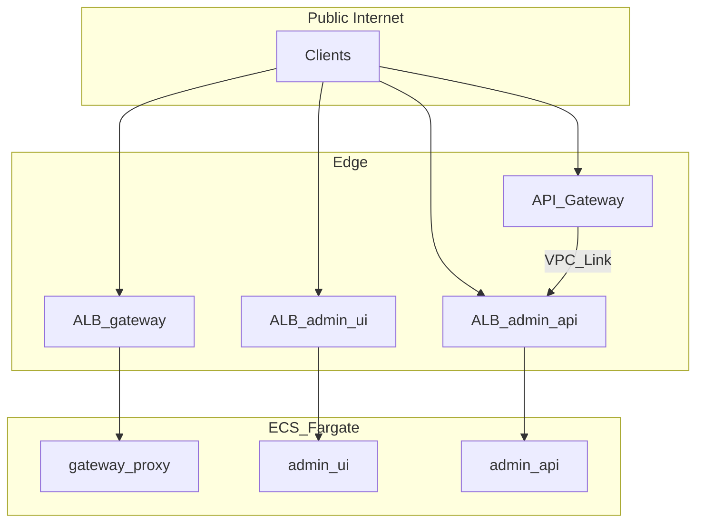

# ECS + API Gateway 배포 아키텍처

## 확정 결정

| 항목 | 결정 |
|------|------|
| 트래픽 경계 | **옵션 A** — data plane ALB→ECS, control REST만 API Gateway, UI는 ALB |
| IaC | **`installer.py` (boto3)** — VPC~ECS 전체 |

## 목표 토폴로지

상세 리소스·설치: [../../ecs/installer.md](../../ecs/installer.md)
